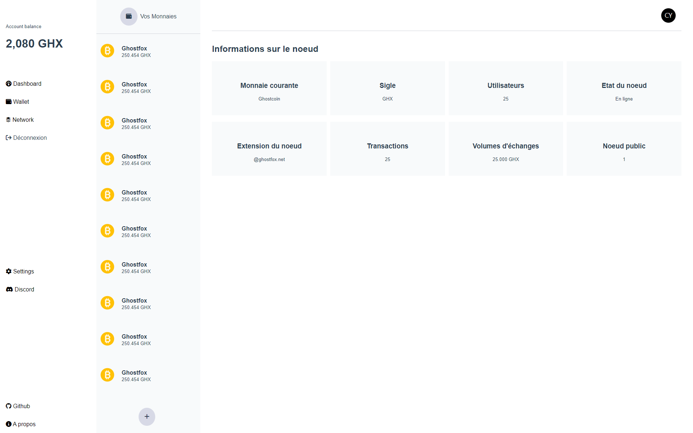

# WalletX - Monnaie virtuelle

Ghostfox est une interface de gestion de monnaie virtuelle réalisée en VueJS3.



## Project setup

### Compiles and hot-reloads for development
```
npm run serve
```

### Customize configuration
See [Configuration Reference](https://cli.vuejs.org/config/).
